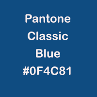

# Pantone Colour of the Year 2020: Classic Blue

The Pantone colour of the year for 2020 is Classic Blue:

* Hex: `#0F4C81`
* RGB: `rgb(15, 76, 129)`
* CMYK: 100, 76, 25, 0

### Links:

* [https://www.pantone.com/color-intelligence/color-of-the-year/color-of-the-year-2020](https://www.pantone.com/color-intelligence/color-of-the-year/color-of-the-year-2020)
* [https://www.pantone.com/color-intelligence/color-of-the-year/color-of-the-year-2020-palette-exploration](https://www.pantone.com/color-intelligence/color-of-the-year/color-of-the-year-2020-palette-exploration)
* [https://www.pantone.com/color-intelligence/color-of-the-year/color-of-the-year-2020-tools-for-designers](https://www.pantone.com/color-intelligence/color-of-the-year/color-of-the-year-2020-tools-for-designers)

