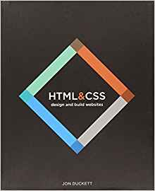
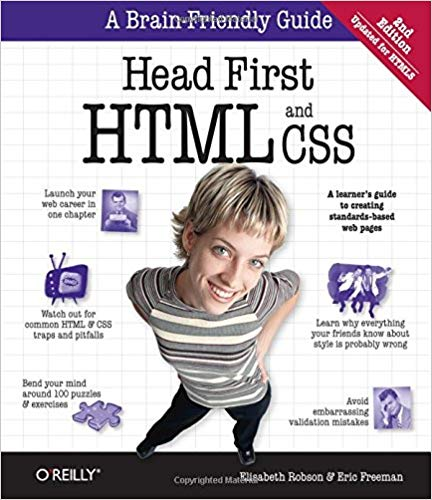

# Books on HTML and CSS

### [HTML and CSS Design and Build Websites](http://www.htmlandcssbook.com/) by Jon Duckett.

This book has been recommended by several people in the introductory web development courses I've been teaching and mentoring in. A very visual approach, using full-colour photographs to explain the two declarative languages.

### [Head-First HTML & CSS](https://www.amazon.com/Head-First-HTML-CSS-Standards-Based/dp/0596159900/ref=sr_1_1?keywords=head+first+html&qid=1570497311&sr=8-1)

The "Head First" imprint is a great place to start in general. This book in the series is a great place to start with practical exercises and examples. Written for the true beginner.

