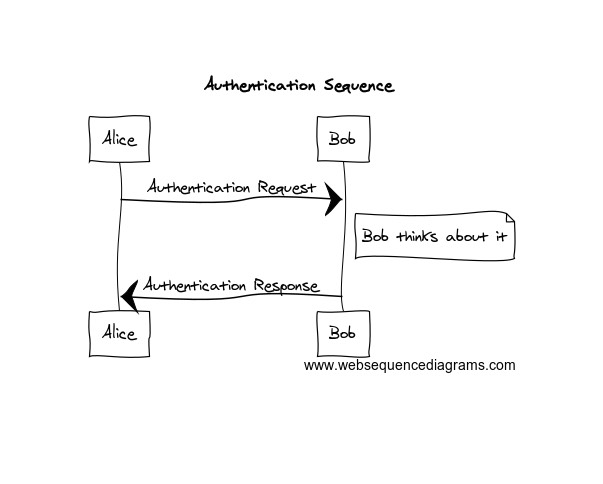

# On-line Tool: Web Sequence Diagrammer

I was reading up on [Gollum](https://github.com/gollum/gollum/wiki), the wiki used by [Github](http://github.com/) when I ran across this cool web tool:

[Web Sequence Diagram](http://www.websequencediagrams.com/?lz=dGl0bGUgQXV0aGVudGljYXRpb24gU2VxdWVuY2UKCkFsaWNlLT5Cb2I6ABUQUmVxdWVzdApub3RlIHJpZ2h0IG9mIAAlBUJvYiB0aGlua3MgYWJvdXQgaXQKQm9iLT4ASgUANxNzcG9uc2UK&s=napkin)

A very awesome online tool that lets you create, as if it wasn’t obvious, sequence diagrams online by writing text lines that indicate the elements of the sequence.

The following textual description:

```text
title Authentication Sequence

Alice->Bob: Authentication Request
note right of Bob: Bob thinks about it
Bob->Alice: Authentication Response
```

creates the following diagram



As you type into the text area, it automatically changes the diagram. One of the really cool things is that you can have the diagram formatted in a number of ways. I personally love the napkin format shown above

